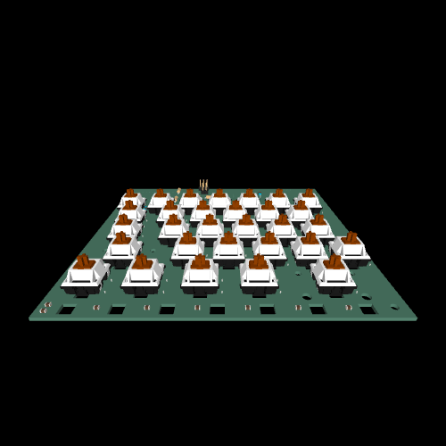
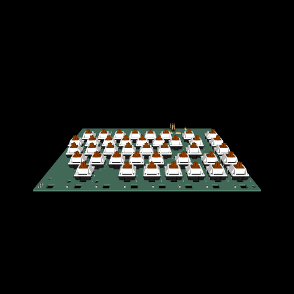
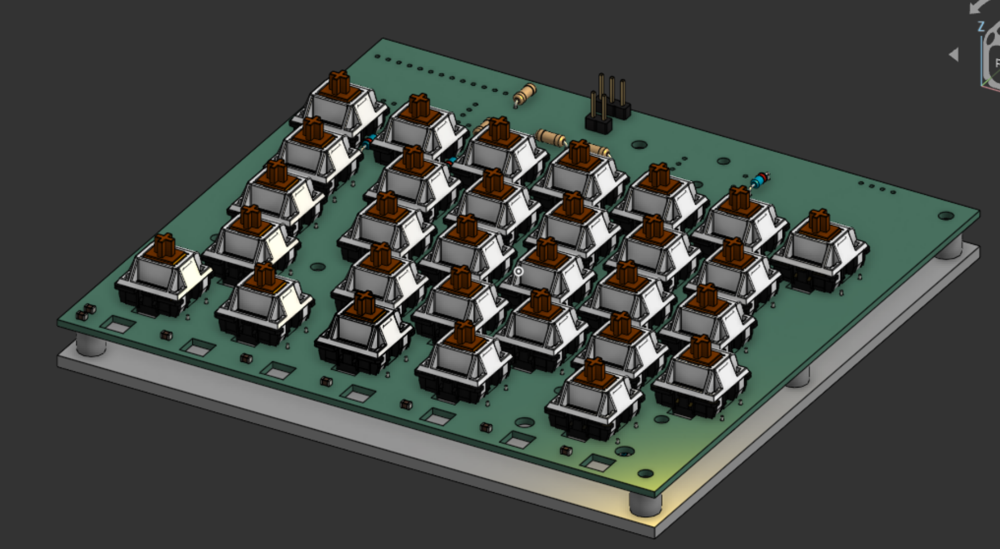
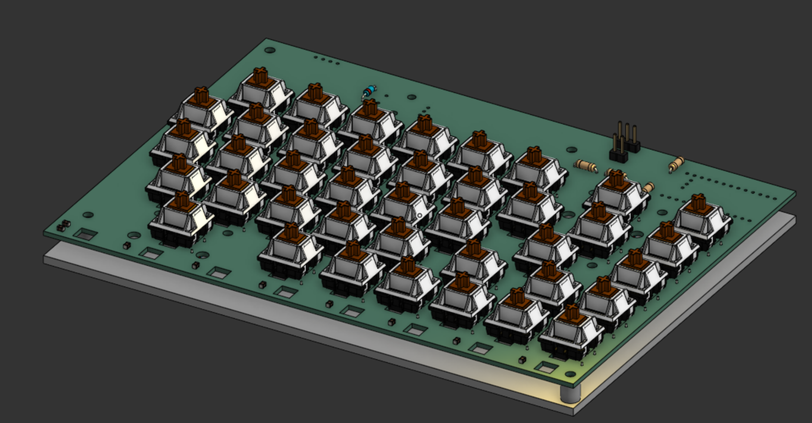
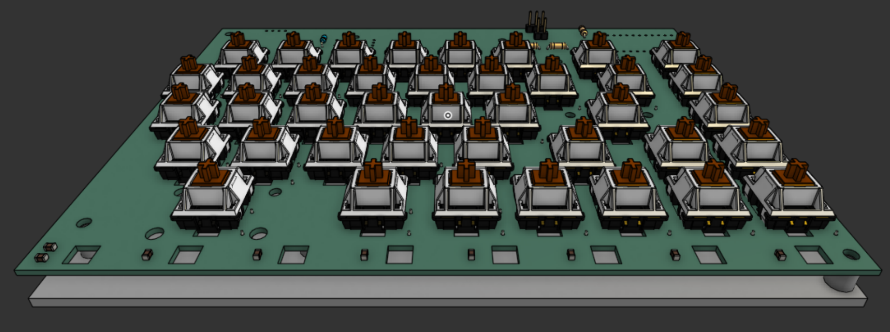
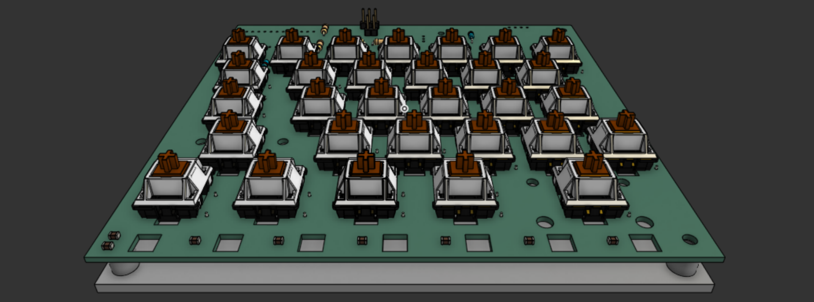
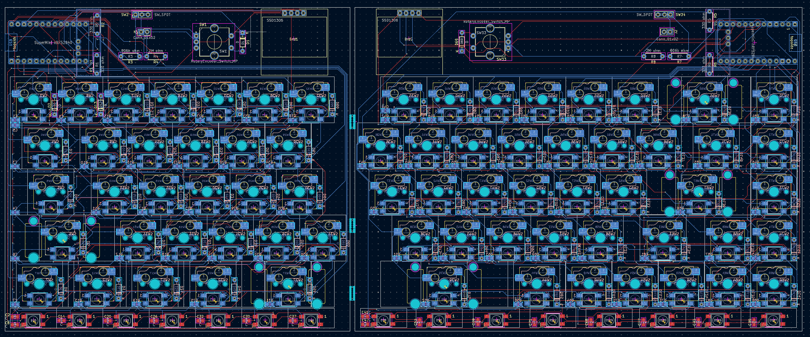
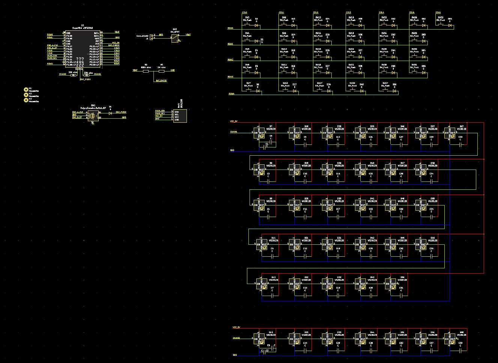
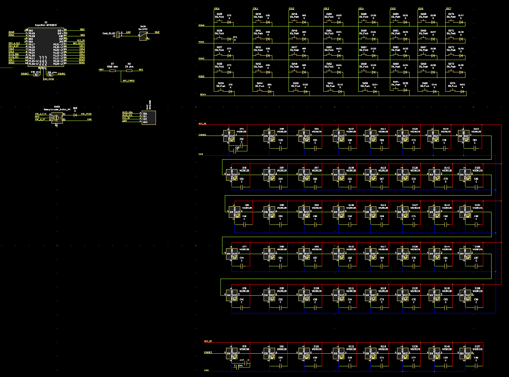
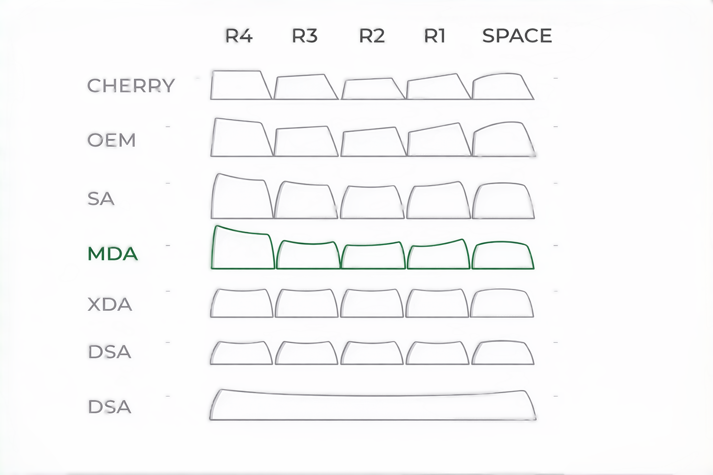

# Splitix MK1

A custom, split mechanical keyboard with modular design, it can be used as a split keyboard or joined together and used like a regular keyboard.

Inspired by the split, futuristic keyboard used by Tony Stark in Iron Man, this project explores that concept in a practical, physical form. Splitix MK1 is the first iteration, focused on building a solid foundation before moving towards more advanced designs.

It features a custom PCB designed in KiCad, per-key NeoPixel RGB lighting, an integrated display, and a rotary encoder. The board also includes battery support with voltage monitoring.

The design includes a fully hand-routed PCB with custom footprints and a skeletal 3D-printed case that enhances the lighting and overall aesthetic.

This project is part of a larger journey toward creating a more advanced, Iron Man - inspired keyboard in future iterations.

| Left Build (without case) | Right Build (without case) |
|-----------|------------|
|  |  |

# Features

- Split / Modular (can be joined and used as a single keyboard)
- Wireless (Bluetooth via NRF52840)
- ZMK Firmware
- Hotswappable
- Per-key NeoPixel RGB
- Rotary Encoder
- Integrated Display
- Skeletal 3D-printed case (M3 mount)

## CAD

| Left | Right |
|------|-------|
|  |  |
|  |  |

## PCB

> **Note:**  
> The PCB is designed as a single board with mouse bite connections, allowing it to be snapped into left and right halves after fabrication.

## Schematic

> **Note:**  
> The preview images may be scaled down and lose detail. Use the PDF below for a clear, full-resolution view.

  

| Left | Right |
|------|-------|
|  |  |

## ZMK Keymap

> need to be added

## BOM

| Product | Quantity | Source | Price (INR) | Link |
| :--- | :--- | :--- | :--- | :--- |
| ProMicro NRF52840 | 2 | Robu | 1516 | [Product Link](https://robu.in/product/promicro-nrf52840-development-board/)   OR   [Product Link](https://robu.in/product/pro-micro-nrf52840-development-board-compatible-with-nicenano-v2-0/) |
| Hongyan EC11H 7CE20P1ZD20 | 2 | Robu | 110 | [Product Link](https://robu.in/product/hongyan-ec11h-7ce20p1zd20-rotary-encoder-with-push-button-switch-vertical-plug-in-5-pin/) |
| EC11 Rotary Encoder Knob (D-shaft) | 2 | Robu | 58 | [Product Link](https://robu.in/product/potentiometer-knob-rotary-switch-cap-black-color-pack-of-5-pcs/) |
| 0.96" / 1.3" I2C OLED | 2 | Robu | 312 | [Product Link](https://robu.in/product/0-96-inch-yellow-yellow-blue-oled-lcd-led-display-module/)   OR   [Product Link](https://robu.in/product/1-3-inch-i2c-iic-4-pin-oled-display-module-with-vcc-gnd-blue/) |
| WS2812B 16-LED Ring (Neopixel) | 6 (rings) / 90 (individual) | Robu / Ktron | 546 | [Product Link](https://robu.in/product/16bit-ws2812b-5050-rgb-led-built-in-full-color-driving-lights-circular-development-board/)   OR   [Product Link](https://www.ktron.in/product/ws2812b-rgb-smd-5050-led/?v=c86ee0d9d7ed) |
| 330Ω Resistor | 4 | Robu | 1.16 | [Product Link](https://robu.in/product/330-ohm-0-25w-metal-film-resistor-pack-of-100/) |
| 806kΩ Resistor | 2 | Robu | 1.24 | [Product Link](https://robu.in/product/mcmf0w4ff8203a50-multicomp-pro-metal-film-resistor-820kohm-250mw-1/) |
| 2MΩ Resistor | 2 | Amazon | 198 | [Product Link](https://www.amazon.in/Electronic-Spices-Tolerance-Through-Resistors/dp/B0BDDRD9DN) |
| 100µF 0805 Capacitor | 6 | Robu | 270 | [Product Link](https://robu.in/product/cl21a107mqynnwe-samsang-6-3v-100uf-x5r-%C2%B120-0805-multilayer-ceramic-capacitors-mlcc-smd-smt-rohs/) |
| 0.1µF (100nF) 0805 Capacitor | 95 | Robu | 145.35 | [Product Link](https://robu.in/product/cc0805jrx7r9bb104-yageo-smd-multilayer-ceramic-capacitor-0-1-%C2%B5f-50-v-0805-2012-metric-%C2%B1-5-x7r-cc-series/) |
| Mechanical Key Switches (MX Compatible) | 75 | StacksKB | 2398 | [Product Link](https://stackskb.com/store/akko-creamy-cyan-switch-pack-of-45-pre-order/) |
| Keycaps (MX Compatible) | 1 set | StacksKB | 1299 | [Product Link](https://stackskb.com/store/veekos-gradient-keycaps-cherry-profile-135-keys/) |
| Hotswap Sockets (Kailh MX) | 75 | StacksKB | 750 | [Product Link](https://stackskb.com/store/ttc-pokayoke-hotswap-sockets-v2-10000-cycles/) |
| 1N4148 Diodes | 80 | StacksKB | 120 | [Product Link](https://stackskb.com/store/1n4148-through-hole-diode/) |
| Li-ion Battery 1500mAh | 2 | Robu | 502 | [Product Link](https://robu.in/product/nova-803450-1500mah-3-7v-lipo-battery-pack/) |
| JST-PH 2-pin Connector | 2 | Robu | 2.84 | [Product Link](https://robu.in/product/jst-sh-2-pin-connector-2mm-pitch/) |
| TP4056 Type-C Charging Module | 2 | Robu | 28 | [Product Link](https://robu.in/product/tp4056-1a-li-ion-lithium-battery-charging-module-with-current-protection-type-c/) |
| Slide Switch SS-12D03 | 2 | Robu | 6 | [Product Link](https://robu.in/product/slide-switch-ss-12d03-1p2t/) |
| Keyboard PCB Left | 5 | Robu | 2500 | [Product Link](https://robu.in/product/online-pcb-manufacturing-service/) |
| Keyboard PCB Right | 5 | Robu | 2500 | [Product Link](https://robu.in/product/online-pcb-manufacturing-service/) |
| Keyboard Case (3D Print) | 1 | Robu | 530 | [Product Link](https://robu.in/product/3d-printing-service/) |
| Screws | 15 | Generic |  | Any mini screws will work |

---

### Total Cost (Maximum)

**₹13,793.59**

> Includes all core components for full build.

---

# Mechanical Keyboard Keycap Profiles

---

### Quick Comparison
| Profile | Key Features | Best Used For |
| :--- | :--- | :--- |
| **Cherry** | Ergonomic height, reduces accidental touches. | All-around daily use. |
| **OEM** | Standard height, crisp typing sound. | Linear switches and gaming. |
| **XDA** | Uniform height, large surface area. | Tactile switches, long typing sessions. |
| **DSA** | Very low, uniform height. | Minimalist builds and customization. |
| **MDA** | Stepped uniform profile, textured feel. | Ergonomic long-form typing. |
| **SA** | Tallest profile, spherical sculpt. | Aesthetics and deep sound (requires wrist rest). |

---

> ### Note:
- **Tall Profiles (SA):** Better acoustics and aesthetics, but poor ergonomics without a wrist rest.  
- **Flat Profiles (XDA, DSA):** Easier to customize looks, but higher chance of mistyping.  
- **Sculpted Profiles (Cherry, OEM, MDA):** Best for typing speed and overall accuracy.  

---

# Keyswitch Selection Guide

| Type | Characteristics | Best For |
| :--- | :--- | :--- |
| **1️⃣ Linear** | Very smooth, no bump. Quiet unless bottom-out → nice thock | Gaming + smooth typing |
| **2️⃣ Tactile** | Noticeable bump mid-press. Balanced sound + feel | Typing |
| **3️⃣ Clicky** | Loud click + tactile bump. Very audible → polarizing | Enthusiasts who love feedback |
| **4️⃣ Low Profile** | Short travel → less thock. More functional than aesthetic | Portable/compact builds |
| **5️⃣ Silent Switches** | Dampened + muted. Almost no sound → office safe | Office environments |  

marbastlib
keyswitch kicad library
keyboard footprints placer
fabrucatuib toolkit
